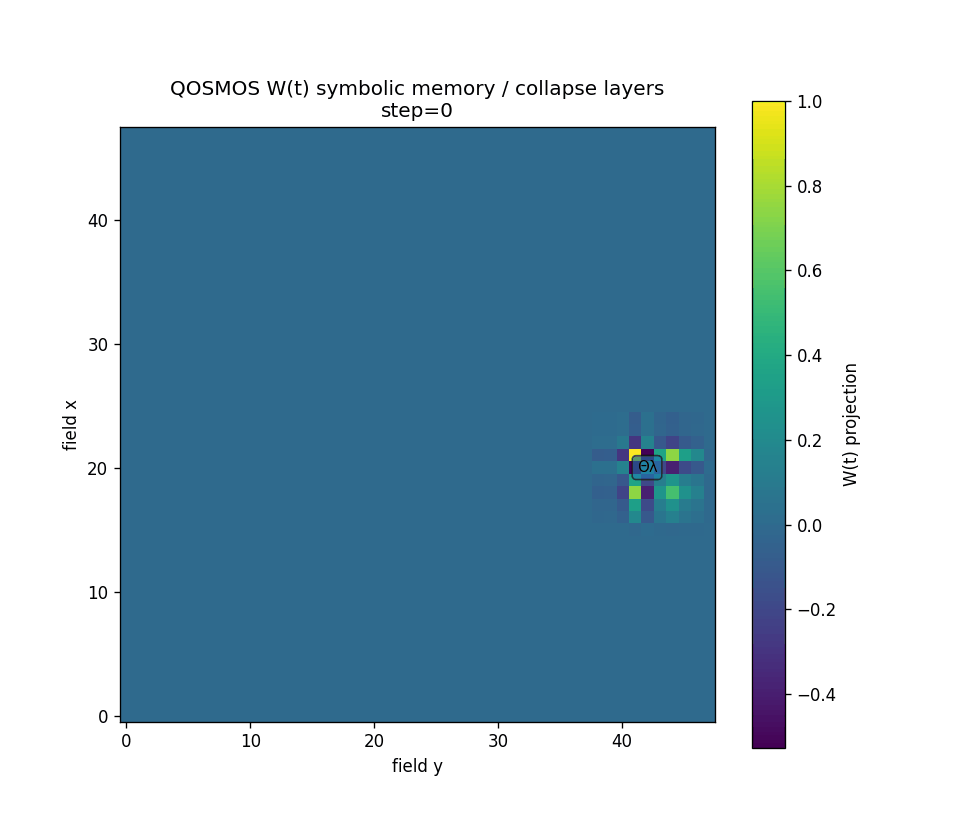

# Holographic Memory Engine (HME)

[](https://github.com/donaldtuttle/HME/actions/workflows/test.yml)


> **The field remembers the shape. The ledger remembers the name.**

HME is a deterministic, source-available research prototype for memory systems that need reconstructive recall **and** auditable identity. It is intended for agent-memory experiments, retrieval and noise benchmarks, provenance-aware replay, and lineage analysis, not as a drop-in production database.



## What HME is for

| Use HME to | What the repository provides |
|---|---|
| Prototype agent memory | Associative reconstruction plus exact artifact receipts |
| Benchmark retrieval | Seeded runs, controlled query noise, and reproducible top-k results |
| Audit provenance | Payload hashes, pattern hashes, source metadata, and ordered lineage |
| Compare memory architectures | Field-only, ledger-only, and hybrid behavior can be separated and tested |
| Study optional salience mechanisms | Default-off C(ψ) write, reranking, and rejection channels with a C0-C7 factorial harness |

HME is a research substrate. Identity-match confidence is not yet calibrated, `NO_MATCH` policy remains open, and the default-off C(ψ) salience channels have **no efficacy claim**.

## How it works

```text
                         ┌─ deterministic pattern ─→ complex field
payload ─→ SHA-256 map ──┤                           reconstructive surface
                         └─ artifact ledger ───────→ identity + provenance
                                                          │
query + position ─→ ranked retrieval ─→ hit list + receipt│
                                                          ↓
                                                   lineage graph
```

Four pieces do different jobs:

1. **Field** - stores superposed patterns and supports reconstructive recall.
2. **Ledger** - preserves exact artifact identity, payload hashes, positions, glyphs, gains, and provenance.
3. **Ranker** - combines position, query, and pattern similarity.
4. **Lineage graph** - records memory and event ancestry for replay and audit.

Exact artifact identification is **not field-only**. The field can retain a decoded surface when the ledger is removed, while exact identity depends on ledger evidence.

## Status at a glance

```text
Package                  qosmos-hme 2.2.0
Python                   3.10+
Current active engine    SHA-256 1caff9577e8a4bdaa2b0510c79673035081a967a25f15067bfa8ce99ccca6d11
Previous public baseline SHA-256 f81fb49e265d83f5206220584dfc6cabf28aeee5266aca33654182be1549c080
Pre-conformance source   SHA-256 6780f974db55380fb4841d3b35c135be10eac8e0c79bc55ff7ff349138febaa6
License                  proprietary, with limited local evaluation rights
Maintenance              owner-maintained; external code contributions closed
```

The current engine includes a **DEVELOP, default-off C(ψ) salience overlay**. Its write-gain, retrieval-reranking, and inscription-rejection switches remain disabled unless explicitly enabled. The C0-C7 harness measures those channels; their presence is not evidence that they improve retrieval.

## Quick start

The proprietary license permits local installation and execution of **unmodified copies** for non-commercial evaluation, testing, and reproduction of published results. It does not grant modification, redistribution, hosted-service, production, or commercial-use rights.

```bash
python -m venv .venv
source .venv/bin/activate       # Windows: .venv\Scripts\activate
pip install -e ".[test,visual,sfd]"

python qosmos_hme_engine.py --self-test
pytest -q
python tests/hme_independent_audit.py \
  --engine ./qosmos_hme_engine.py \
  --output outputs/hme_audit.json
```

Minimal use:

```python
from qosmos_hme_engine import QOSMOSCoreHME

hme = QOSMOSCoreHME(memory_size=64, encoding_resolution=16, seed=7)
artifact = hme.encode_memory(
    [0.1, 0.4, 0.9, 0.2],
    position=(20, 22),
    glyph="Σ◯",
)
receipt = hme.retrieve_memory((20, 22), query=[0.1, 0.4, 0.9, 0.2])
print(artifact.artifact_id, receipt.confidence)
```

## Verified behavior

### Stable active-engine bridge invariants

The SFD to HME bridge preserved these invariants across the observed Python 3.10, 3.12, and 3.13 CI matrix:

```text
engine SHA-256   1caff9577e8a4bdaa2b0510c79673035081a967a25f15067bfa8ce99ccca6d11
signature hash   7fef693477ffaf55104f12f25be9b91b72a8ab8e4aed8d13c4c3604fa5719ce9
trajectory hash  e90921fbd2fd990efab3b684249de68a28e7186e8fc226d2f3ca3a4038e8f5db
retrieval score  0.9307851800354883 ± 1e-12
write glyph      Σ◯
top hit           committed artifact
```

### Exact numeric-byte receipts

The exact artifact ID includes hashes of floating-point payload bytes and an FFT-derived pattern. Two complete byte receipts have been observed across heterogeneous runners:

| Variant | Artifact ID | Payload hash | Pattern hash |
|---|---|---|---|
| `numeric_bytes_7264` | `7264c7cc7b27aceb15f1` | `cae26ced…e2ea8` | `3381e092…2d67` |
| `numeric_bytes_d902` | `d902825c52772941b345` | `d363f67b…0b4b` | `f28f0fa6…54b3` |

The bridge gate requires all stable invariants plus one **complete** recognized tuple. Components from different tuples are never mixed. A new tuple fails validation pending investigation.

This boundary is consistent with low-order numerical or FFT-backend variation, although the exact cause has not been isolated. A portable rounded or quantized hash representation would change artifact identity and remains separate future work.

The independent audit reproduced deterministic artifacts within its pinned environment, exact linear-superposition reconstruction, and these numeric top-1 results:

| Gaussian query noise σ | Correct top-1 |
|---:|---:|
| `0.00-0.25` | `128 / 128` |
| `0.50` | `119 / 128` |
| `1.00` | `59 / 128` |

Full evidence is under [`evidence/`](evidence/). The cross-run bridge record is [`evidence/bridge_active_engine_validation_2026-08-24.json`](evidence/bridge_active_engine_validation_2026-08-24.json), and the exact validation policy is documented in [`docs/REPRODUCIBILITY.md`](docs/REPRODUCIBILITY.md).

## Important limitation

The current `confidence` value reports the selected hit's base relevance score. It is **not** a calibrated probability and is not, by itself, a rejection decision. An unrelated query received a score near `0.733` during audit. Do not interpret every top-ranked result as a valid identity match.

The optional C(ψ) channels are deliberately kept outside semantic confidence:

- relevance eligibility and `NO_MATCH` are decided first;
- optional salience may rerank only eligible candidates;
- write-time `c_psi` is provenance;
- query-dependent scores are not written back to artifacts;
- inscription rejection has a distinct outcome.

A calibrated threshold or explicit production-grade `NO_MATCH` policy remains open.

## Repository map

| Path | Purpose |
|---|---|
| [`qosmos_hme_engine.py`](qosmos_hme_engine.py) | Active engine and command-line self-test |
| [`tests/`](tests/) | Contract, determinism, bridge, and independent-audit tests |
| [`evidence/`](evidence/) | Frozen baseline outputs and audit records |
| [`experiments/c0_c7_harness.py`](experiments/c0_c7_harness.py) | DEVELOP factorial measurement harness |
| [`docs/ARCHITECTURE.md`](docs/ARCHITECTURE.md) | Technical architecture |
| [`docs/KNOWN_LIMITATIONS.md`](docs/KNOWN_LIMITATIONS.md) | Known failure boundaries |
| [`docs/QOFT_QOSMOS_CONTEXT.md`](docs/QOFT_QOSMOS_CONTEXT.md) | Optional framework provenance and operator crosswalk |
| [`docs/MANIFEST_SCOPE.md`](docs/MANIFEST_SCOPE.md) | What `MANIFEST.sha256` does and does not pin |
| [`docs/RELEASE_PLAN.md`](docs/RELEASE_PLAN.md) | GitHub-native version/tag map |
| [`skills/hme/SKILL.md`](skills/hme/SKILL.md) | Portable agent-facing contract |

## Agent skill

The portable [`hme`](skills/hme/SKILL.md) Agent Skill defines the encode, retrieve, replay, telemetry, and lineage contract for the pinned HME realization. It is proprietary and does not relicense the engine. See [`docs/agent-skill.md`](docs/agent-skill.md) and [`LICENSE-NOTICE.md`](LICENSE-NOTICE.md).

## Framework provenance

HME originated within the QOSMOS research stack, but it stands on its own as a deterministic memory engine. The detailed QOFT/QOSMOS operator crosswalk has been moved to [`docs/QOFT_QOSMOS_CONTEXT.md`](docs/QOFT_QOSMOS_CONTEXT.md) so the repository front door does not require prior framework vocabulary.

Those mappings describe provenance and compatibility only. They do not promote HME into canon, validate QOFT, or broaden claims beyond this tested realization.

## Rights and maintenance

HME is **source-available proprietary software**, not open source. The [`LICENSE`](LICENSE) grants narrow local rights to install and execute unmodified copies for non-commercial evaluation, testing, and result reproduction. All other rights are reserved.

External code, documentation, dataset, and asset contributions are not accepted. Reproducibility reports and defect notices may be filed as GitHub issues; see [`CONTRIBUTING.md`](CONTRIBUTING.md).

Passing tests and implementation-conformance checks demonstrate only the behavior documented for this realization. They do not establish consciousness, physical collapse, or universal memory dynamics.
