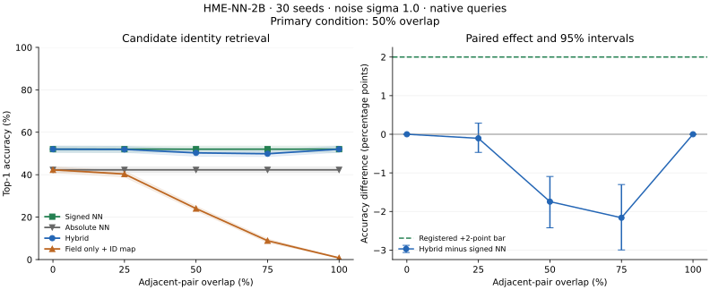

# HME-NN-2B: candidate-specific field retrieval

**The hybrid has lower accuracy than signed NN in the registered primary condition.**

Registration: [`6d83732`](https://github.com/donaldtuttle/HME/commit/6d837326fccabd79fd2bd431dbfd895df4bee5ed). The protocol, scorer, evaluator and fixtures were public before evaluation.

Execution: 2026-09-25T13:46:05.998008+00:00 through 2026-09-25T13:46:54.925718+00:00. All 30 registered seeds completed; deviations: 0. All registered correctness gates passed and all retrieval snapshots fit the 4 MiB cap.

## Primary result

128 Gaussian items, dimension 16, one item at each content-independent grid position, 16-by-16 patches, a fixed 256-by-256 field, spacing 8 (50% adjacent-pair overlap), native query preprocessing and Gaussian noise sigma 1.0.

| Arm | Mean top-1 accuracy (%) [95% seed-bootstrap interval] |
|---|---:|
| Signed NN | 52.03 [50.55, 53.46] |
| Absolute NN | 42.29 [40.96, 43.65] |
| Hybrid | 50.29 [48.67, 51.85] |
| Field only + ID map | 24.04 [22.94, 25.16] |
| Hybrid, field association permuted | 49.71 [48.33, 51.07] |

**Hybrid minus signed NN: -1.74 [-2.42, -1.09] percentage points.** The preregistered minimum useful gain was +2 points, requiring the entire paired 95% interval to exceed +2. The unit of uncertainty is the independent seed, not individual queries sharing a field; 20,000 paired bootstrap resamples were used.

The field score is now both query-dependent and candidate-specific: normalized Frobenius correlation between the query pattern and the candidate-position field patch. The hybrid uses `0.42 * signed_cosine + 0.20 * field_score`, with fixed weights, no clipping, no distance term, no tuning and no target-address input. This tests a new experimental readout, while retaining the pinned HME encoder/writer.

## Overlap and mechanism controls

Overlap denotes the shared area of adjacent horizontal/vertical patches; diagonal overlap is its square. It is not the union of overlap with all neighbours. Layout assignment is random and independent of content, and field dimensions stay fixed.



The plot uses native preprocessing at sigma 1.0. Shading/error bars show 95% seed-bootstrap intervals. Only 50% overlap is the confirmatory condition; the other comparisons are descriptive.

| Adjacent overlap | Spacing | Signed NN (%) | Hybrid (%) | Field only (%) | Absolute NN (%) | Permuted hybrid (%) | Hybrid minus NN (pp), 95% interval |
|---:|---:|---:|---:|---:|---:|---:|---:|
| 0% | 16 | 52.03 | 52.03 | 42.29 | 42.29 | 46.88 | 0.00 [0.00, 0.00] |
| 25% | 12 | 52.03 | 51.93 | 40.31 | 42.29 | 47.73 | -0.10 [-0.47, 0.29] |
| 50% | 8 | 52.03 | 50.29 | 24.04 | 42.29 | 49.71 | -1.74 [-2.42, -1.09] |
| 75% | 4 | 52.03 | 49.87 | 8.88 | 42.29 | 50.39 | -2.16 [-2.99, -1.30] |
| 100% | 0 | 52.03 | 52.03 | 0.78 | 42.29 | 52.03 | 0.00 [0.00, 0.00] |

Registered structural results:

- At zero overlap, field-only target ranks matched absolute NN, and hybrid target ranks matched signed NN in every ordinary-data condition. For isolated patterns, the field score is absolute cosine squared; `0.42*c + 0.20*c*c` is strictly increasing on [-1,1]. This is a mathematical control, not empirical evidence of an advantage.
- At the shared position, hybrid and permuted-hybrid rankings/predictions matched signed NN exactly; field-only tied all candidates and scored 1/128 (0.78125%) top-1.
- The zero-field primary-layout control matched signed NN. Cached and uncached scores/ranks agreed on every registered check.

At the primary condition, hybrid minus permuted hybrid is **0.57 [-0.29, 1.41] points**. This is a descriptive association control: beating a deliberately misassociated field does not by itself establish improvement over signed NN.

## Reconstruction diagnostic

Each loaded candidate patch is compared with its own isolated write contribution. Relative error is `norm(loaded - isolated) / norm(isolated)`. These diagnostics use the known stored contribution; they are not target-only retrieval competitors. Absolute NN supplies the equivalent isolated-pattern ranking reference.

| Overlap | Mean relative error [95% interval] | Mean pattern correlation [95% interval] |
|---:|---:|---:|
| 0% | 0.000 [0.000, 0.000] | 1.000 [1.000, 1.000] |
| 25% | 0.379 [0.373, 0.384] | 0.931 [0.929, 0.933] |
| 50% | 1.610 [1.608, 1.613] | 0.535 [0.534, 0.536] |
| 75% | 3.610 [3.594, 3.626] | 0.297 [0.296, 0.298] |
| 100% | 45.423 [45.178, 45.669] | 0.358 [0.356, 0.360] |

## Polarity stress

Each corpus has 64 vectors and their negatives, and each query has a paired exact negation. Queries use symmetric preprocessing. Opposite-sign query patterns are identical, so a deterministic field-only ranker can identify at most one member per equally weighted pair. The 50% ceiling applies to this constructed stress set, not to arbitrary random corpora.

| Overlap | Noise | Signed NN (%) | Absolute NN (%) | Hybrid (%) | Field only (%) | Permuted hybrid (%) |
|---:|---:|---:|---:|---:|---:|---:|
| 0% | 0 | 100.00 | 50.00 | 100.00 | 50.00 | 87.34 |
| 0% | 1 | 40.78 | 20.39 | 40.78 | 20.39 | 30.63 |
| 25% | 0 | 100.00 | 50.00 | 100.00 | 50.00 | 89.71 |
| 25% | 1 | 40.78 | 20.39 | 40.65 | 20.36 | 31.59 |
| 50% | 0 | 100.00 | 50.00 | 99.97 | 49.66 | 98.88 |
| 50% | 1 | 40.78 | 20.39 | 40.39 | 18.44 | 37.03 |
| 75% | 0 | 100.00 | 50.00 | 100.00 | 43.59 | 99.90 |
| 75% | 1 | 40.78 | 20.39 | 39.22 | 12.53 | 38.91 |
| 100% | 0 | 100.00 | 50.00 | 100.00 | 0.78 | 100.00 |
| 100% | 1 | 40.78 | 20.39 | 40.78 | 0.78 | 40.78 |

Every paired field-only score row was identical to its opposite-sign counterpart, and every seed/layout respected the 50% bound. No polarity-preserving encoder was tested.

## Measured storage, query and cache costs

All search variants return only candidate indices/IDs and scores. The old default API workload that constructs decoded outputs is absent from **every** arm. These experimental snapshots and optimized matrix operations therefore must not be compared as if their timings reproduced HME-NN-1 or HME-NN-2A.

NN retains processed vectors. Field-only retains the field and optional readout cache, without original item vectors or per-item-pattern caches. Hybrid retains vectors and field. All arms retain identical records, lineage and address maps. The source HME writer used during construction is discarded from search snapshots and accounted separately; its state is not silently counted as free retained memory.

Primary-layout costs:

| Variant | Median persistent bytes | Maximum bytes | Numeric array bytes | Median query (ms) | Median seed p95 (ms) | Median paired latency / signed NN |
|---|---:|---:|---:|---:|---:|---:|
| Signed NN | 188,620 | 188,716 | 34,816 | 0.0216 | 0.0334 | 1.00 |
| Absolute NN | 188,620 | 188,716 | 34,816 | 0.0189 | 0.0279 | 0.88 |
| Hybrid cached | 1,762,164 | 1,762,164 | 1,607,680 | 0.0904 | 0.1605 | 4.21 |
| Hybrid uncached | 1,237,748 | 1,237,748 | 1,083,392 | 0.6314 | 0.9401 | 29.35 |
| Field only cached | 1,729,240 | 1,729,240 | 1,574,912 | 0.0836 | 0.1553 | 3.88 |
| Field only uncached | 1,204,824 | 1,204,824 | 1,050,624 | 0.6162 | 0.9296 | 28.57 |
| Permuted hybrid cached | 1,763,284 | 1,763,284 | 1,608,704 | 0.1005 | 0.1862 | 4.66 |

The primary-layout source writer's median accounted build-state size is 1,817,320 bytes, separate from retained search-state accounting.

| Overlap | Hybrid cache build (ms) | Cache discard (microseconds) | Hybrid cached query (ms) | Hybrid uncached query (ms) | Field cached query (ms) | Field uncached query (ms) |
|---:|---:|---:|---:|---:|---:|---:|
| 0% | 0.5288 | 0.801 | 0.0911 | 0.6569 | 0.0866 | 0.6392 |
| 25% | 0.5019 | 0.852 | 0.0907 | 0.6422 | 0.0847 | 0.6204 |
| 50% | 0.5115 | 0.896 | 0.0904 | 0.6314 | 0.0836 | 0.6162 |
| 75% | 0.5464 | 0.861 | 0.0928 | 0.6551 | 0.0872 | 0.6412 |
| 100% | 0.5403 | 0.691 | 0.0725 | 0.6178 | 0.0665 | 0.5994 |

Cost summaries use medians across per-seed medians/p95s on this host. Queries include preprocessing and query-pattern encoding, top-k 5, one numerical-library thread, three repeats of 16 queries per layout/seed, three warmups per variant and rotated execution order. Cache build/discard uses five cycles per seed/layout. Discard timing is not a complete write-throughput measurement. The shared-position readout exploits identical patches when computing scores; its stored full cache is still charged.

Recursive Python object/owned-array accounting deduplicates aliases. It excludes interpreter/shared code, allocator overhead, discarded source state and transient query workspace. These are retained bytes, not peak process RSS. The common cap and task size are matched; consumed bytes are not padded to equality. All per-layout storage and per-query timings are available in the saved data.

## All ordinary-data retrieval conditions

Values below are seed means. All 95% intervals and paired contrasts, including for the antipodal conditions, are in the aggregate JSON. Only the designated primary comparison is confirmatory; other intervals are descriptive without multiplicity adjustment. Perfect observed means do not guarantee perfect population performance.

### Top-1 accuracy (%)

| Overlap | Mode | Noise | Signed NN | Absolute NN | Hybrid | Field only | Permuted hybrid |
|---:|---|---:|---:|---:|---:|---:|---:|
| 0% | native | 0 | 99.974 | 99.974 | 99.974 | 99.974 | 97.995 |
| 0% | symmetric | 0 | 100.000 | 100.000 | 100.000 | 100.000 | 91.667 |
| 0% | native | 0.25 | 99.870 | 99.792 | 99.870 | 99.792 | 97.240 |
| 0% | symmetric | 0.25 | 99.661 | 99.479 | 99.661 | 99.479 | 88.464 |
| 0% | native | 0.5 | 94.740 | 91.927 | 94.740 | 91.927 | 89.141 |
| 0% | symmetric | 0.5 | 87.839 | 82.604 | 87.839 | 82.604 | 70.312 |
| 0% | native | 1 | 52.031 | 42.292 | 52.031 | 42.292 | 46.875 |
| 0% | symmetric | 1 | 40.443 | 31.536 | 40.443 | 31.536 | 30.651 |
| 25% | native | 0 | 99.974 | 99.974 | 99.948 | 99.688 | 98.411 |
| 25% | symmetric | 0 | 100.000 | 100.000 | 100.000 | 99.922 | 93.542 |
| 25% | native | 0.25 | 99.870 | 99.792 | 99.870 | 99.010 | 97.865 |
| 25% | symmetric | 0.25 | 99.661 | 99.479 | 99.635 | 99.089 | 90.677 |
| 25% | native | 0.5 | 94.740 | 91.927 | 94.557 | 89.089 | 90.130 |
| 25% | symmetric | 0.5 | 87.839 | 82.604 | 87.917 | 81.328 | 72.161 |
| 25% | native | 1 | 52.031 | 42.292 | 51.927 | 40.312 | 47.734 |
| 25% | symmetric | 1 | 40.443 | 31.536 | 40.208 | 30.599 | 31.875 |
| 50% | native | 0 | 99.974 | 99.974 | 99.922 | 85.156 | 99.844 |
| 50% | symmetric | 0 | 100.000 | 100.000 | 99.974 | 97.708 | 99.193 |
| 50% | native | 0.25 | 99.870 | 99.792 | 99.714 | 79.141 | 99.531 |
| 50% | symmetric | 0.25 | 99.661 | 99.479 | 99.427 | 93.854 | 98.333 |
| 50% | native | 0.5 | 94.740 | 91.927 | 93.724 | 60.964 | 92.266 |
| 50% | symmetric | 0.5 | 87.839 | 82.604 | 87.188 | 72.526 | 83.438 |
| 50% | native | 1 | 52.031 | 42.292 | 50.286 | 24.036 | 49.714 |
| 50% | symmetric | 1 | 40.443 | 31.536 | 40.078 | 26.693 | 37.422 |
| 75% | native | 0 | 99.974 | 99.974 | 99.896 | 39.661 | 99.922 |
| 75% | symmetric | 0 | 100.000 | 100.000 | 100.000 | 69.141 | 99.974 |
| 75% | native | 0.25 | 99.870 | 99.792 | 99.688 | 34.583 | 99.714 |
| 75% | symmetric | 0.25 | 99.661 | 99.479 | 99.375 | 60.495 | 99.297 |
| 75% | native | 0.5 | 94.740 | 91.927 | 93.568 | 24.036 | 93.307 |
| 75% | symmetric | 0.5 | 87.839 | 82.604 | 86.562 | 38.385 | 85.964 |
| 75% | native | 1 | 52.031 | 42.292 | 49.870 | 8.880 | 50.391 |
| 75% | symmetric | 1 | 40.443 | 31.536 | 39.375 | 12.865 | 39.115 |
| 100% | native | 0 | 99.974 | 99.974 | 99.974 | 0.781 | 99.974 |
| 100% | symmetric | 0 | 100.000 | 100.000 | 100.000 | 0.781 | 100.000 |
| 100% | native | 0.25 | 99.870 | 99.792 | 99.870 | 0.781 | 99.870 |
| 100% | symmetric | 0.25 | 99.661 | 99.479 | 99.661 | 0.781 | 99.661 |
| 100% | native | 0.5 | 94.740 | 91.927 | 94.740 | 0.781 | 94.740 |
| 100% | symmetric | 0.5 | 87.839 | 82.604 | 87.839 | 0.781 | 87.839 |
| 100% | native | 1 | 52.031 | 42.292 | 52.031 | 0.781 | 52.031 |
| 100% | symmetric | 1 | 40.443 | 31.536 | 40.443 | 0.781 | 40.443 |

### Top-5 accuracy (%)

| Overlap | Mode | Noise | Signed NN | Absolute NN | Hybrid | Field only | Permuted hybrid |
|---:|---|---:|---:|---:|---:|---:|---:|
| 0% | native | 0 | 100.000 | 100.000 | 100.000 | 100.000 | 100.000 |
| 0% | symmetric | 0 | 100.000 | 100.000 | 100.000 | 100.000 | 100.000 |
| 0% | native | 0.25 | 100.000 | 100.000 | 100.000 | 100.000 | 100.000 |
| 0% | symmetric | 0.25 | 100.000 | 100.000 | 100.000 | 100.000 | 100.000 |
| 0% | native | 0.5 | 99.609 | 99.219 | 99.609 | 99.219 | 99.505 |
| 0% | symmetric | 0.5 | 98.307 | 96.276 | 98.307 | 96.276 | 97.578 |
| 0% | native | 1 | 80.964 | 71.693 | 80.964 | 71.693 | 79.453 |
| 0% | symmetric | 1 | 70.807 | 58.516 | 70.807 | 58.516 | 67.214 |
| 25% | native | 0 | 100.000 | 100.000 | 100.000 | 100.000 | 100.000 |
| 25% | symmetric | 0 | 100.000 | 100.000 | 100.000 | 100.000 | 100.000 |
| 25% | native | 0.25 | 100.000 | 100.000 | 100.000 | 99.948 | 100.000 |
| 25% | symmetric | 0.25 | 100.000 | 100.000 | 100.000 | 100.000 | 100.000 |
| 25% | native | 0.5 | 99.609 | 99.219 | 99.635 | 98.594 | 99.531 |
| 25% | symmetric | 0.5 | 98.307 | 96.276 | 98.281 | 96.250 | 97.578 |
| 25% | native | 1 | 80.964 | 71.693 | 80.885 | 70.234 | 79.740 |
| 25% | symmetric | 1 | 70.807 | 58.516 | 70.703 | 58.281 | 67.969 |
| 50% | native | 0 | 100.000 | 100.000 | 100.000 | 97.240 | 100.000 |
| 50% | symmetric | 0 | 100.000 | 100.000 | 100.000 | 100.000 | 100.000 |
| 50% | native | 0.25 | 100.000 | 100.000 | 100.000 | 95.547 | 100.000 |
| 50% | symmetric | 0.25 | 100.000 | 100.000 | 100.000 | 99.974 | 100.000 |
| 50% | native | 0.5 | 99.609 | 99.219 | 99.583 | 86.901 | 99.557 |
| 50% | symmetric | 0.5 | 98.307 | 96.276 | 98.177 | 95.104 | 98.021 |
| 50% | native | 1 | 80.964 | 71.693 | 80.312 | 51.927 | 80.469 |
| 50% | symmetric | 1 | 70.807 | 58.516 | 70.573 | 56.771 | 69.896 |
| 75% | native | 0 | 100.000 | 100.000 | 100.000 | 72.448 | 100.000 |
| 75% | symmetric | 0 | 100.000 | 100.000 | 100.000 | 96.250 | 100.000 |
| 75% | native | 0.25 | 100.000 | 100.000 | 100.000 | 67.083 | 100.000 |
| 75% | symmetric | 0.25 | 100.000 | 100.000 | 100.000 | 92.500 | 100.000 |
| 75% | native | 0.5 | 99.609 | 99.219 | 99.453 | 52.682 | 99.427 |
| 75% | symmetric | 0.5 | 98.307 | 96.276 | 98.255 | 76.042 | 98.099 |
| 75% | native | 1 | 80.964 | 71.693 | 80.443 | 25.521 | 80.286 |
| 75% | symmetric | 1 | 70.807 | 58.516 | 70.026 | 36.667 | 70.026 |
| 100% | native | 0 | 100.000 | 100.000 | 100.000 | 3.906 | 100.000 |
| 100% | symmetric | 0 | 100.000 | 100.000 | 100.000 | 3.906 | 100.000 |
| 100% | native | 0.25 | 100.000 | 100.000 | 100.000 | 3.906 | 100.000 |
| 100% | symmetric | 0.25 | 100.000 | 100.000 | 100.000 | 3.906 | 100.000 |
| 100% | native | 0.5 | 99.609 | 99.219 | 99.609 | 3.906 | 99.609 |
| 100% | symmetric | 0.5 | 98.307 | 96.276 | 98.307 | 3.906 | 98.307 |
| 100% | native | 1 | 80.964 | 71.693 | 80.964 | 3.906 | 80.964 |
| 100% | symmetric | 1 | 70.807 | 58.516 | 70.807 | 3.906 | 70.807 |

### Mean reciprocal rank

| Overlap | Mode | Noise | Signed NN | Absolute NN | Hybrid | Field only | Permuted hybrid |
|---:|---|---:|---:|---:|---:|---:|---:|
| 0% | native | 0 | 1.000 | 1.000 | 1.000 | 1.000 | 0.990 |
| 0% | symmetric | 0 | 1.000 | 1.000 | 1.000 | 1.000 | 0.957 |
| 0% | native | 0.25 | 0.999 | 0.999 | 0.999 | 0.999 | 0.986 |
| 0% | symmetric | 0.25 | 0.998 | 0.997 | 0.998 | 0.997 | 0.939 |
| 0% | native | 0.5 | 0.969 | 0.951 | 0.969 | 0.951 | 0.940 |
| 0% | symmetric | 0.5 | 0.924 | 0.887 | 0.924 | 0.887 | 0.824 |
| 0% | native | 1 | 0.649 | 0.556 | 0.649 | 0.556 | 0.613 |
| 0% | symmetric | 1 | 0.540 | 0.446 | 0.540 | 0.446 | 0.471 |
| 25% | native | 0 | 1.000 | 1.000 | 1.000 | 0.998 | 0.992 |
| 25% | symmetric | 0 | 1.000 | 1.000 | 1.000 | 1.000 | 0.967 |
| 25% | native | 0.25 | 0.999 | 0.999 | 0.999 | 0.995 | 0.989 |
| 25% | symmetric | 0.25 | 0.998 | 0.997 | 0.998 | 0.995 | 0.951 |
| 25% | native | 0.5 | 0.969 | 0.951 | 0.968 | 0.933 | 0.945 |
| 25% | symmetric | 0.5 | 0.924 | 0.887 | 0.924 | 0.879 | 0.836 |
| 25% | native | 1 | 0.649 | 0.556 | 0.649 | 0.539 | 0.619 |
| 25% | symmetric | 1 | 0.540 | 0.446 | 0.539 | 0.439 | 0.480 |
| 50% | native | 0 | 1.000 | 1.000 | 1.000 | 0.907 | 0.999 |
| 50% | symmetric | 0 | 1.000 | 1.000 | 1.000 | 0.988 | 0.996 |
| 50% | native | 0.25 | 0.999 | 0.999 | 0.999 | 0.864 | 0.998 |
| 50% | symmetric | 0.25 | 0.998 | 0.997 | 0.997 | 0.968 | 0.992 |
| 50% | native | 0.5 | 0.969 | 0.951 | 0.964 | 0.724 | 0.956 |
| 50% | symmetric | 0.5 | 0.924 | 0.887 | 0.920 | 0.825 | 0.899 |
| 50% | native | 1 | 0.649 | 0.556 | 0.637 | 0.372 | 0.633 |
| 50% | symmetric | 1 | 0.540 | 0.446 | 0.537 | 0.409 | 0.520 |
| 75% | native | 0 | 1.000 | 1.000 | 0.999 | 0.543 | 1.000 |
| 75% | symmetric | 0 | 1.000 | 1.000 | 1.000 | 0.807 | 1.000 |
| 75% | native | 0.25 | 0.999 | 0.999 | 0.998 | 0.491 | 0.999 |
| 75% | symmetric | 0.25 | 0.998 | 0.997 | 0.997 | 0.742 | 0.996 |
| 75% | native | 0.5 | 0.969 | 0.951 | 0.963 | 0.376 | 0.962 |
| 75% | symmetric | 0.5 | 0.924 | 0.887 | 0.916 | 0.549 | 0.912 |
| 75% | native | 1 | 0.649 | 0.556 | 0.635 | 0.183 | 0.638 |
| 75% | symmetric | 1 | 0.540 | 0.446 | 0.532 | 0.250 | 0.531 |
| 100% | native | 0 | 1.000 | 1.000 | 1.000 | 0.042 | 1.000 |
| 100% | symmetric | 0 | 1.000 | 1.000 | 1.000 | 0.042 | 1.000 |
| 100% | native | 0.25 | 0.999 | 0.999 | 0.999 | 0.042 | 0.999 |
| 100% | symmetric | 0.25 | 0.998 | 0.997 | 0.998 | 0.042 | 0.998 |
| 100% | native | 0.5 | 0.969 | 0.951 | 0.969 | 0.042 | 0.969 |
| 100% | symmetric | 0.5 | 0.924 | 0.887 | 0.924 | 0.042 | 0.924 |
| 100% | native | 1 | 0.649 | 0.556 | 0.649 | 0.042 | 0.649 |
| 100% | symmetric | 1 | 0.540 | 0.446 | 0.540 | 0.042 | 0.540 |

## Unmatched queries and limits

| Arm | Accepted / total across layouts and preprocessing modes |
|---|---:|
| Signed NN | 4800 / 4800 |
| Absolute NN | 4800 / 4800 |
| Hybrid | 4800 / 4800 |
| Field only + ID map | 4800 / 4800 |
| Hybrid, field association permuted | 4800 / 4800 |

These are fresh Gaussian queries with no designated stored target, reused across layouts and modes. They are not independent replicates or a distribution-shift set. All methods use closed-set ranking without rejection. Scores are not calibrated probabilities.

This experiment concerns synthetic identity retrieval at one item count and vector dimension. It does not establish semantic retrieval, a capacity frontier, superiority to other HRR/VSA designs or production persistence. Independent positions change the task relative to HME-NN-1/2A, so their headline accuracies must not be pooled.

**Stage 3 accuracy gate: not passed.** This run supplies no registered accuracy-advantage justification for proceeding automatically to an encoder redesign.

## Reproduction and raw evidence

Environment: Python 3.12.14, NumPy 2.5.3. The aggregate report records exact source hashes, platform and numerical-library configuration; raw seed files include dataset/layout/field/readout hashes, candidate identity maps, predictions, target ranks, diagnostics and cost samples.

- [Frozen protocol](PROTOCOL.md) and [machine-readable specification](protocol.json)
- [Aggregate analysis and provenance](results/results.json)
- [Every seed result](results/)

```bash
python experiments/field_retrieval_v1/evaluate.py \
  --registration-commit 6d837326fccabd79fd2bd431dbfd895df4bee5ed \
  --output outputs/field_retrieval_v1_replication
```

Use a new output directory. The evaluator verifies frozen sources before execution. Timings and object sizes vary by environment. Install `.[visualization]` and run `python experiments/field_retrieval_v1/render_report.py` to recreate this report and plot from saved observations without evaluating seeds again.
