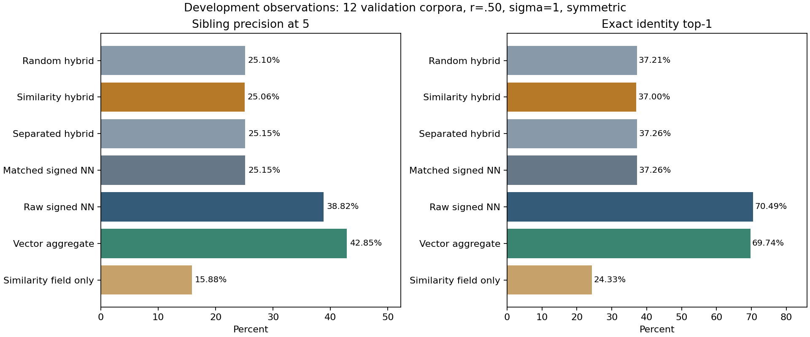
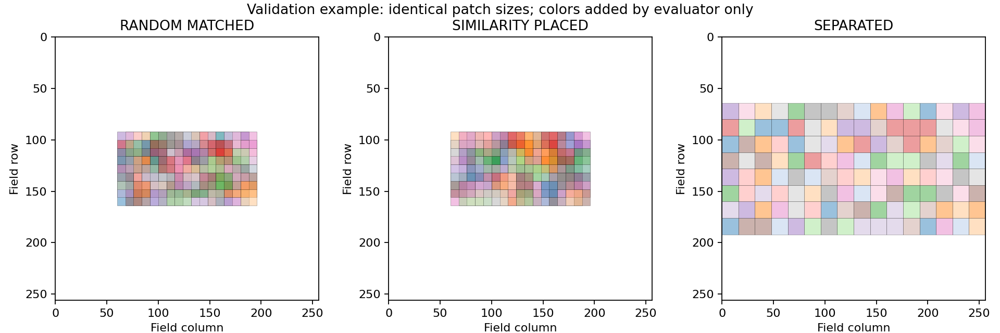
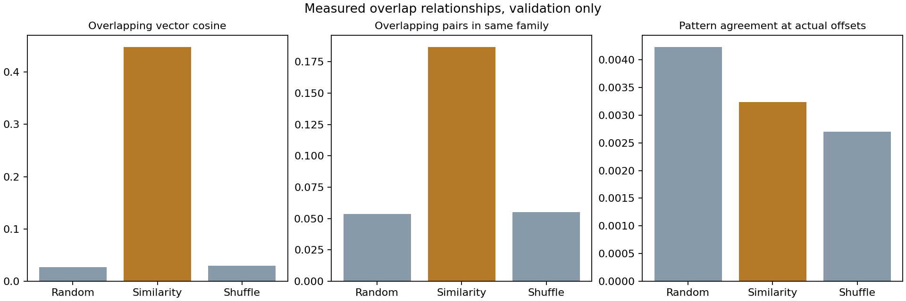
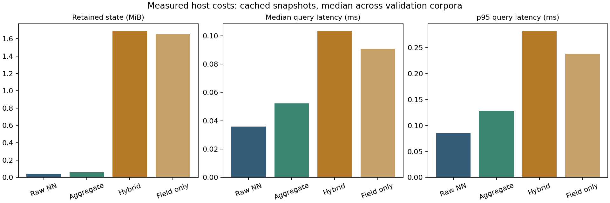

# HME-MO-1 development and validation

**READY_FOR_PROTOCOL_REVIEW. DESIGN / DEVELOP. No confirmatory evaluation.**

The placement algorithm put more similar memories into overlapping patches, but the tested hybrid did not retrieve siblings better than matched random placement. Raw vector search and the frozen vector aggregation baseline performed substantially better in these validation corpora. These observations apply to this whole-patch encoder/readout and do not test explicit shared-feature binding. (ρ̂_conf_HIGH: measured development observations)

## What changed

Added the isolated experiment under `experiments/meaningful_overlap_v1/` and correctness tests in `tests/test_meaningful_overlap.py`. The implementation includes separate data/layout/query streams, opaque identities, four rebuilt layouts, all requested retrieval arms, source/registration guards, six-contrast statistics, serial cost measurement and four static plots. Production code, historical experiment files, source pins and archived manifests are byte-preserved. Only the root payload manifest gains the new files.

## Executed work and evidence boundary

| Work | Scope |
|---|---|
| Development smoke | `HME-MO-1/development/000..001`, primary cell plus correctness/512 controls |
| Vector tuning | All 12 `validation_tune/000..011` corpora, 30 predeclared rules |
| Validation check | All 12 separate `validation_check/000..011` corpora, 4 shared variances ×4 noise levels ×2 query modes, four rebuilt layouts and permutation control |
| Cost remeasurement | Same 12 exposed validation corpora, independent uncached snapshots, serial measurement, every primary rank/metric record checked against original |
| Reserved test | No generation or inspection; 50 proposed namespaces remain guarded |

The tuning plan and implementation were committed locally at `41e2fb4` before tuning. The selected baseline and constant-bootstrap correction were committed at `b7b15d7` before validation_check. The cost isolation correction was committed at `fead5a8` before the serial cost pass. These original local commits are retained in `development/source-history.bundle`; its prerequisite is the unchanged base `a4d871618e31b8184c2cf5c2e13c9256accd254d`. Run manifests also record exact source/configuration hashes, timestamps and host versions. A remote review commit is a delivery record, not a preregistration.

Raw development records are delivered separately as `HME-MO-1-development-records.zip`; its checksum and inventory are recorded in `DEVELOPMENT_RECEIPT.json`. It includes the original validation records and their original cost measurements, the corrected serial cost records, all query target ranks/top-six candidates/sibling scores, identities/maps, geometry, cache checks, source hashes, all tuning candidates and command receipts. No failed corpus was dropped or replaced. `DEVELOPMENT_SUMMARY.json` provides compact machine-readable means, all six contrasts, descriptive cells and costs.

## Primary validation observations

128 memories, 16 families, dimension 16, r=.50, query sigma=1, four perturbations/item, symmetric preprocessing. Values are means of 12 independent corpus means. They are not preregistered results. (ρ̂_conf_HIGH)

| Method | Sibling precision at 5 | Exact top-1 |
|---|---:|---:|
| Random matched hybrid | 25.104% | 37.207% |
| Similarity placed hybrid | 25.055% | 36.995% |
| Separated hybrid | 25.153% | 37.256% |
| Matched signed NN | 25.153% | 37.256% |
| Raw signed NN | 38.815% | 70.492% |
| Frozen vector aggregate | 42.852% | 69.743% |
| Similarity placed field only | 15.882% | 24.333% |
| Geometry-preserving content shuffle, hybrid | 25.111% | 37.028% |
| Broken field association, hybrid | 24.753% | 33.724% |



The vector rule selected exclusively on validation_tune is **raw representation, k=8, lambda=.25**. Its entire 30-rule table is in FROZEN_BASELINE.json. The mean tuning identity accuracy was 69.710%, compared with 70.459% for raw NN, so it met the predeclared tuning feasibility criterion. The separate validation_check results did not select or alter it. (ρ̂_conf_HIGH)

All effects below are similarity hybrid minus comparator, in percentage points. Ordinary two-sided 95% intervals are separate from the one-sided Bonferroni decision lower bounds. These are applications of proposed decision logic to validation data, not confirmatory decisions. (ρ̂_conf_HIGH)

| Contrast | Mean effect | Ordinary 95% interval | Decision lower bound | Required > | Clears on validation? |
|---|---:|---:|---:|---:|---|
| Siblings vs random hybrid | -0.049 | [-0.186, +0.078] | -0.218 | +2.0 | No |
| Siblings vs separated hybrid | -0.098 | [-0.202, +0.007] | -0.221 | +2.0 | No |
| Siblings vs raw NN | -13.760 | [-15.192, -12.119] | -15.469 | +2.0 | No |
| Siblings vs vector aggregate | -17.796 | [-19.398, -16.025] | -19.685 | +2.0 | No |
| Identity vs matched signed NN | -0.260 | [-0.830, +0.309] | -0.944 | -1.0 | Yes |
| Identity vs raw NN | -33.496 | [-35.221, -31.738] | -35.612 | -1.0 | No |

The diagnostic conclusion is ADVANTAGE_NOT_ESTABLISHED. Placement was achieved, but the association and full identity criteria were not met. The matched-vector identity safeguard alone cleared its proposed bound; the raw-vector safeguard did not. The random-placement interval crossing zero does not prove equality. (ρ̂_conf_HIGH: decision applied to exposed validation data)

## Did meaningful placement happen?

Yes, as defined by the whole-vector placement objective. All 12 primary corpora exceeded the achieved-intervention threshold. The smallest J improvement was 0.3894. Random and similarity layouts each had 442 intersecting slot pairs and maximum local occupancy four, with the same complete intersection geometry. (ρ̂_conf_HIGH)

| Weighted measurement | Random matched | Similarity placed | Content shuffle |
|---|---:|---:|---:|
| Signed cosine among overlapping vectors | 0.0272 | 0.4478 | 0.0292 |
| Same-family overlap fraction, evaluator only | 5.366% | 18.670% | 5.490% |
| Normalized real pattern agreement at actual offsets | 0.00423 | 0.00324 | 0.00270 |
| Accumulated patch relative error vs own isolated write | 1.61385 | 1.60924 | 1.60699 |

Putting related vectors together did not produce correspondingly strong pattern agreement where the patches actually intersected. This observation distinguishes the implemented whole-patch arrangement from explicit alignment of shared features. It does not isolate a unique cause of the retrieval result. (ρ̂_conf_MED: mechanism interpretation)





## Descriptive conditions and precision

All 32 r/noise/mode cells were retained. The primary cell was neither an identity floor nor ceiling: the similarity hybrid was about 37% exact and 25% sibling precision. The r=0 control gave 5.273% sibling precision for that arm at sigma=1, compared with the exchangeable-label reference 7/127 = 5.512%; those arbitrary family labels are not recoverable relationships supplied by the generator. Native mode at r=.50/sigma=1 gave 29.297% sibling precision and 46.924% exact identity. It remains descriptive and does not replace the symmetric primary. (ρ̂_conf_HIGH: development measurements)

For proposed n=50, validation SDs imply approximate Bonferroni halfwidths of **0.084, 0.064, 0.961, 1.052, 0.355 and 1.096 percentage points**, in contrast order. These normal-approximation planning estimates do not guarantee bootstrap coverage or power. They suggest adequate precision to detect a genuine +2-point placement effect of the proposed size, but these validation means provide no reason to expect that effect from the unchanged configuration. Keep n=50 proposed for review; do not generate more corpora in search of a win. (ρ̂_conf_MED: planning inference)

The 256-to-512 canvas-only control had maximum score difference **0.0**, with exact ranking agreement for all three layouts. Changing spacing to 12 on 512 was a separate descriptive intervention: hybrid sibling precision 25.218%, exact identity 37.321%. Any difference belongs to changed geometry, not canvas size alone. (ρ̂_conf_HIGH)

## Absolute costs and limits

Python 3.12.14, NumPy 2.3.5, Linux x86_64; the full host string is in the run manifest. One numerical-library thread, identical five-index/five-score output, warmups and rotated order. The table uses the corrected serial cost pass. Latencies are medians of corpus medians/p95s; ratios are medians of paired corpus ratios. (ρ̂_conf_HIGH: measurements on this host)

| Arm, cached unless specified | Retained bytes | Serialized bytes | Median ms | p95 ms | Median latency / raw NN |
|---|---:|---:|---:|---:|---:|
| Raw signed NN | 43,712 | 37,573 | 0.0359 | 0.0850 | 1.00 |
| Vector aggregate | 61,205 | 55,019 | 0.0523 | 0.1276 | 1.45 |
| Similarity hybrid | 1,769,670 | 1,735,035 | 0.1032 | 0.2817 | 2.88 |
| Similarity field only | 1,736,746 | 1,701,989 | 0.0908 | 0.2382 | 2.51 |
| Similarity hybrid, uncached | 1,245,526 | 1,210,471 | 0.8158 | 1.3995 | 22.38 |
| 512/spacing12 hybrid | 4,918,982 | 4,880,827 | 0.1082 | 0.2372 | see raw per-corpus records |

At 256, the complex field is 1,048,576 bytes, processed hybrid vectors 32,768, candidate positions 2,048, and accumulated-patch cache 524,288. Records, lineage, IDs/maps and Python object overhead account for the rest. The vector aggregate's numerical arrays total 49,280 bytes, including its neighbor graph. The 512 field is 4,194,304 bytes. All measured cached and uncached snapshots fit the proposed 16 MiB cap. The field-only method is charged for its field, accumulated-patch cache and metadata; it has no original vectors or isolated patterns. (ρ̂_conf_HIGH)

Similarity placement took a median 49.68 ms; the vector graph took 0.76 ms. Inserting all 128 writes in the similarity layout took 15.36 ms, separately from snapshot/cache construction. Cache preparation took 0.620 ms and invalidation 0.00332 ms. Rewrite throughput was not measured. Original construction timings remain descriptive host measurements, not deployment benchmarks. (ρ̂_conf_HIGH)

Separately traced query workspace peaks were 10,264 bytes for raw NN and 24,097 for the cached similarity hybrid. Whole-process high-water RSS was 593,969,152 bytes during validation and 186,318,848 during the serial cost pass. These include evaluator records, builders, simultaneous arms and transient allocations and are not per-arm retained memory. Retained-state counts exclude interpreter/shared code and allocator overhead. Serialized NPZ+JSON size is a different quantity. (ρ̂_conf_HIGH)



The absolute cached-query increments are small on this host; their ratios and retained memory still matter for scaling. No deployment workload is specified, so this package makes no production-suitability verdict. (ρ̂_conf_MED)

## Corrections, failures and verification

Three development issues were corrected, with original records preserved:

1. A fixture demanded exact -1 for normalized offset agreement and received -0.9999999999999998. It now uses the declared 1e-12 tolerance.
2. The 50-corpus constant-effect bootstrap fixture exposed summation roundoff that could wrongly clear a strict threshold. Constant columns now retain their exact input value. Corrected before validation_check; tuning does not use this bootstrap.
3. Initial uncached timing variants shared an object with cached variants. They now have independent cache-free snapshots. The initial validation costs are retained but superseded by the serial cost pass. That pass also avoided overlap with repository test processes. All primary and larger-spacing metric/rank records reproduced exactly.

No corpus failed in development, tuning, validation or the serial cost pass. The negative findings above are performance observations, not failed execution. The failure-record test intentionally injects an error in a temporary development fixture and verifies preservation without replacement; that is not a study failure. (ρ̂_conf_HIGH)

Executed commands from the repository root used `.venv/bin/python`:

```bash
python -m pytest -q tests/test_meaningful_overlap.py
python -m pytest -q --junitxml=outputs/hme-mo-1/current-tests-final.xml
python hme_engine.py --self-test
python tests/hme_independent_audit.py --engine ./hme_engine.py --output outputs/hme-mo-1/hme-audit.json
python examples/runtime_demo.py > outputs/hme-mo-1/runtime-demo.json
sha256sum --check --quiet MANIFEST.sha256
sha256sum --check --quiet SOURCE_PINS.sha256
sha256sum --check --quiet archive/v2.2.sha256
(cd archive/v2.2 && ../../.venv/bin/python -m pytest -q)
python -m experiments.meaningful_overlap_v1.evaluate development --output outputs/hme-mo-1/development
python -m experiments.meaningful_overlap_v1.evaluate tune --output outputs/hme-mo-1/validation-tune
python -m experiments.meaningful_overlap_v1.evaluate validation --output outputs/hme-mo-1/validation-check
python -m experiments.meaningful_overlap_v1.remeasure_costs outputs/hme-mo-1/validation-check --output outputs/hme-mo-1/costs-serial
python -m experiments.meaningful_overlap_v1.render_report outputs/hme-mo-1/validation-check --cost-source outputs/hme-mo-1/costs-serial --output experiments/meaningful_overlap_v1/figures
```

The final receipts provide exact counts and exit codes. The focused suite has 28 passing tests, including a mocked remote-registration test that rejects stale remote refs without generating any reserved data. Current and archived suite results are recorded in DEVELOPMENT_RECEIPT.json. Built-in self-test and existing retrieval audit passed their implementation checks. Those older audit data are regression verification only and are not fresh HME-MO-1 evidence.

Untested: reserved test corpora, a live approved confirmatory run, other Python/NumPy environments, shared-feature binding, encoder redesign, larger item/patch capacity, production adoption, remote CI until the review branch runs it, and algorithmic novelty. The research package is ready for protocol review; it supplies no validation-based reason to expect the proposed full success gate to pass unchanged. A separate feature-binding design would be a new intervention requiring separate authorization and protocol. (ρ̂_conf_MED: recommendation from validation)
