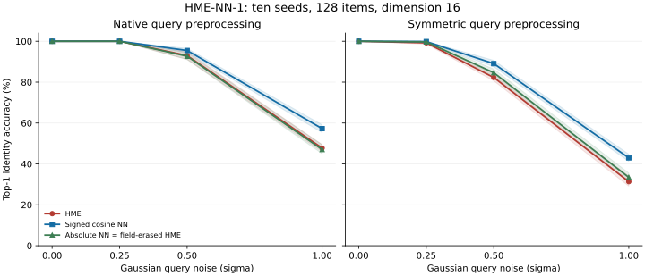

# HME-NN-1: preregistered nearest-neighbor results

Registration: [`88520eb`](https://github.com/donaldtuttle/HME/commit/88520eb82d9852e1176132fe5b2dd4ea011026f5). The protocol, evaluator and correctness fixtures were pushed before the registered seeds ran.

Execution: 2026-09-25T02:48:51.569818+00:00 through 2026-09-25T02:49:54.524164+00:00. All 10 registered seeds completed. Protocol deviations: 0. The engine source is unchanged.

## Primary result

Registered decision: **`hme_lower_accuracy_in_primary_condition`**.

The current HME ranker lost to exact signed-cosine nearest neighbors in the registered primary comparison, with lower accuracy on all ten seeds. For this tested retrieval task, exact NN with the same retained provenance is the better default. The result does not support a retrieval advantage for HME.

The primary condition is native query preprocessing, Gaussian noise sigma 1.0, 128 candidates and dimension 16. The primary metric is top-1 identity accuracy.

| Method or paired contrast | Mean and paired-seed bootstrap 95% interval |
|---|---:|
| HME | 47.73% [46.02, 49.45] |
| Signed cosine NN | 57.27% [55.31, 59.14] |
| HME minus signed cosine NN (percentage points) | -9.53 [-10.70, -8.28] |

The preregistered advantage rule required the lower interval endpoint to exceed +2 percentage points, with both methods inside the common 4 MiB storage cap. All arms fit the cap. The uncertainty unit is the independent seed, not an individual query sharing a field: 20,000 paired bootstrap resamples of ten seed-level means.

## All registered retrieval conditions

The primary cell above is confirmatory. Every other cell and contrast is descriptive; intervals below are not adjusted for multiple comparisons. NN methods retain copies of the exact processed vectors, artifact records and lineage available to HME. All items share one position; no target identity is supplied to retrieval.



### Top-1 accuracy

| Query mode | Noise sigma | HME | Signed cosine NN | Absolute NN / field-erased HME |
|---|---:|---:|---:|---:|
| native | 0 | 100.00% [100.00, 100.00] | 100.00% [100.00, 100.00] | 100.00% [100.00, 100.00] |
| symmetric | 0 | 100.00% [100.00, 100.00] | 100.00% [100.00, 100.00] | 100.00% [100.00, 100.00] |
| native | 0.25 | 100.00% [100.00, 100.00] | 100.00% [100.00, 100.00] | 100.00% [100.00, 100.00] |
| symmetric | 0.25 | 99.22% [98.59, 99.69] | 99.84% [99.61, 100.00] | 99.69% [99.38, 100.00] |
| native | 0.5 | 92.97% [91.09, 94.84] | 95.47% [94.53, 96.48] | 92.66% [91.02, 94.38] |
| symmetric | 0.5 | 82.27% [80.62, 83.98] | 89.06% [87.50, 90.62] | 84.61% [82.97, 86.41] |
| native | 1 | 47.73% [46.02, 49.45] | 57.27% [55.31, 59.14] | 47.03% [45.00, 49.38] |
| symmetric | 1 | 31.33% [29.14, 34.06] | 42.97% [41.25, 44.77] | 33.44% [31.33, 35.55] |

### Top-5 accuracy

| Query mode | Noise sigma | HME | Signed cosine NN | Absolute NN / field-erased HME |
|---|---:|---:|---:|---:|
| native | 0 | 100.00% [100.00, 100.00] | 100.00% [100.00, 100.00] | 100.00% [100.00, 100.00] |
| symmetric | 0 | 100.00% [100.00, 100.00] | 100.00% [100.00, 100.00] | 100.00% [100.00, 100.00] |
| native | 0.25 | 100.00% [100.00, 100.00] | 100.00% [100.00, 100.00] | 100.00% [100.00, 100.00] |
| symmetric | 0.25 | 99.84% [99.53, 100.00] | 100.00% [100.00, 100.00] | 100.00% [100.00, 100.00] |
| native | 0.5 | 99.06% [98.52, 99.61] | 99.38% [98.98, 99.77] | 98.67% [98.05, 99.30] |
| symmetric | 0.5 | 95.31% [94.14, 96.48] | 98.59% [98.05, 99.06] | 96.41% [95.47, 97.34] |
| native | 1 | 74.14% [71.72, 76.09] | 84.38% [83.12, 85.47] | 76.09% [74.06, 77.81] |
| symmetric | 1 | 61.80% [59.53, 63.67] | 75.08% [73.28, 76.41] | 63.59% [60.70, 65.78] |

### Mean reciprocal rank

| Query mode | Noise sigma | HME | Signed cosine NN | Absolute NN / field-erased HME |
|---|---:|---:|---:|---:|
| native | 0 | 1.000 [1.000, 1.000] | 1.000 [1.000, 1.000] | 1.000 [1.000, 1.000] |
| symmetric | 0 | 1.000 [1.000, 1.000] | 1.000 [1.000, 1.000] | 1.000 [1.000, 1.000] |
| native | 0.25 | 1.000 [1.000, 1.000] | 1.000 [1.000, 1.000] | 1.000 [1.000, 1.000] |
| symmetric | 0.25 | 0.996 [0.991, 0.998] | 0.999 [0.998, 1.000] | 0.998 [0.996, 1.000] |
| native | 0.5 | 0.957 [0.945, 0.968] | 0.972 [0.967, 0.979] | 0.955 [0.944, 0.966] |
| symmetric | 0.5 | 0.882 [0.869, 0.897] | 0.931 [0.921, 0.942] | 0.899 [0.887, 0.913] |
| native | 1 | 0.600 [0.585, 0.614] | 0.692 [0.678, 0.702] | 0.599 [0.583, 0.616] |
| symmetric | 1 | 0.454 [0.439, 0.473] | 0.572 [0.556, 0.585] | 0.474 [0.458, 0.490] |

The absolute-NN and field-erased HME target ranks matched for every query in every registered cell. A zero-width interval at perfect observed accuracy describes these seeds; it is not a population guarantee.

### Primary result by seed

| Seed | HME correct / 128 | Signed NN correct / 128 | Absolute NN correct / 128 |
|---:|---:|---:|---:|
| 104729 | 55 | 70 | 57 |
| 130363 | 65 | 78 | 70 |
| 155921 | 58 | 73 | 59 |
| 181081 | 60 | 73 | 58 |
| 205759 | 61 | 76 | 65 |
| 231701 | 67 | 80 | 65 |
| 257053 | 57 | 65 | 55 |
| 282427 | 61 | 72 | 57 |
| 308081 | 63 | 74 | 57 |
| 333667 | 64 | 72 | 59 |

## Field contribution and acceptance

At the primary condition, HME minus absolute NN (equivalently field-erased HME) is **0.70 [-1.02, 2.34] percentage points**. This isolates the field contribution while retaining the current absolute-similarity rule. It is a descriptive mechanism check, not a replacement primary.

At this shared position and with salience off, erasing the field leaves `score = 0.38 + 0.42 * absolute_cosine`, which preserves the absolute-NN ordering. The full ranker adds `0.20 * pattern_score`; this term depends on the stored candidate and field, but not on the current query.

| Method | Unmatched queries accepted / total (both query modes) |
|---|---:|
| HME | 320 / 320 |
| Signed cosine NN | 320 / 320 |
| Absolute cosine NN | 320 / 320 |
| HME, field erased | 320 / 320 |

These queries are fresh Gaussian vectors without a designated stored target, not a distribution-shift set. Default closed-set acceptance is not calibrated correctness or evidence of useful rejection. No Brier/ECE value is computed from raw ranking scores.

Removing the records and cached vectors/patterns while retaining the field returned zero identified hits in 10/10 structural checks. The decoded surfaces remained nonzero. The current API needs retained records to attach identities.

## Persistent storage and online API latency

| Method | Median persistent bytes | Maximum persistent bytes | Numeric array bytes | Median query latency (ms) | Median seed p95 (ms) |
|---|---:|---:|---:|---:|---:|
| HME | 834,156 | 834,540 | 622,592 | 2.5323 | 3.2920 |
| Signed cosine NN | 186,266 | 186,338 | 33,792 | 0.0366 | 0.0674 |
| Absolute cosine NN | 186,266 | 186,338 | 33,792 | 0.0256 | 0.0507 |
| HME, field erased | 834,420 | 834,420 | 622,592 | 2.3415 | 3.0026 |

HME retains **4.48 times** the median accounted storage of signed NN. The median paired HME/NN query-latency ratio is **68.9 times**.

Storage is recursive CPython object accounting, including arrays, field, cached patterns, records, provenance and containers, with aliases counted once. It excludes interpreter, shared libraries, allocator overhead and temporary query buffers. This is a common maximum budget at equal task size, not an equal-consumed-byte capacity frontier.

Latency uses 32 primary-condition queries per seed, four warmups per arm, three repetitions, rotated method order, top-k 5, and one numerical-library thread. Values are medians of per-seed medians/p95s on this shared host. HME also produces reconstructed outputs; NN only returns IDs and scores. These are current implementation/API costs, not intrinsic algorithmic lower bounds or equivalent-output microbenchmarks.

## Scope and reproducibility

This experiment covers synthetic Gaussian identity retrieval at one load, dimension and shared position. It does not establish semantic text retrieval, performance with useful spatial cues, HRR/VSA comparisons, field-controller/salience efficacy, calibrated rejection, production persistence or a storage-capacity frontier. Those remain later stages of [the evaluation plan](../../docs/EVALUATION_PLAN.md).

Environment: Python 3.12.14, NumPy 2.5.3; the raw report records the platform, numerical-library configuration, thread settings, source hashes and dataset hashes.

- [Frozen protocol](PROTOCOL.md) and [machine-readable specification](protocol.json)
- [Aggregate results and provenance](results/results.json)
- [Per-seed raw predictions, ranks, timings and costs](results/)

From the repository checkout, with NumPy installed:

```bash
python experiments/nn_baseline_v1/evaluate.py \
  --registration-commit 88520eb82d9852e1176132fe5b2dd4ea011026f5 \
  --output outputs/nn_baseline_v1_replication
```

The output directory must not already exist. The evaluator verifies the frozen sources against the registration commit. Accuracy and rankings are deterministic for these inputs and compatible numerical environments; timings and Python object sizes can differ. Install `.[visualization]` and run `python experiments/nn_baseline_v1/render_report.py` to redraw this report from the committed results without rerunning evaluation.
